# HomeLab 3 - Adding a ticketing server.

Purpose - Create a ticketing system tied to my current AD lab set up

### Support Set Up
I mapped a shared network drive to easily share screenshots between multiple devices via Samba (my lab PC is Windows dualbooted on an old MacBook, my primary PC is Linux.) 
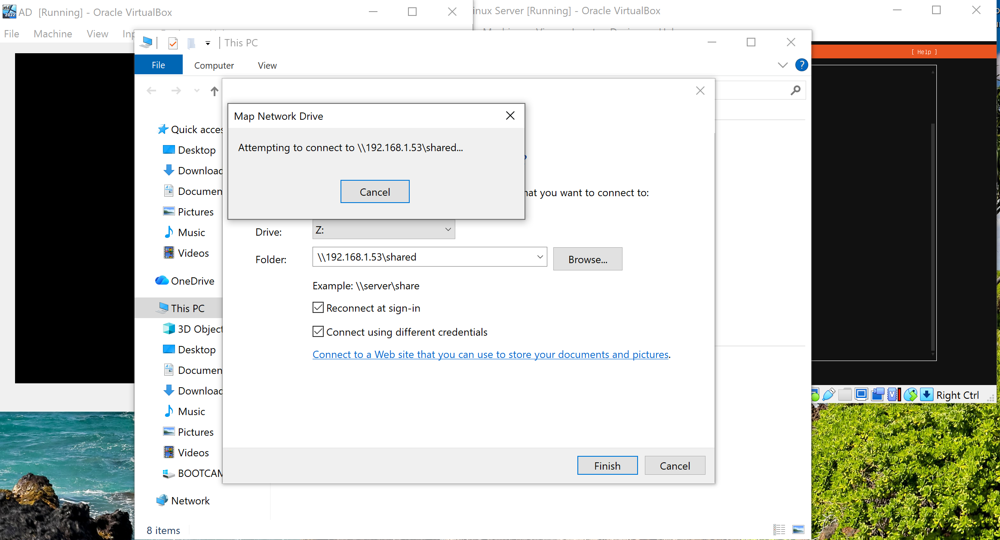

### Environment 
Ubuntu Server 26.04.1
osTicket 
PHP (8.5.4)
MariaDB
Oracle VirtualBox with Bridged Networking (3 VMs total - each with 2GB RAM and 20GB disk space)

### Set Up

1. Downloaded and spun up a VM of Ubuntu Server via VirtualBox
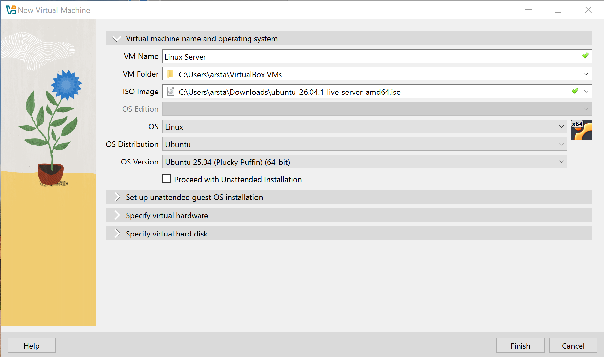 
2. Set a static IP address for the Linux server for communication with the Active Directory Server
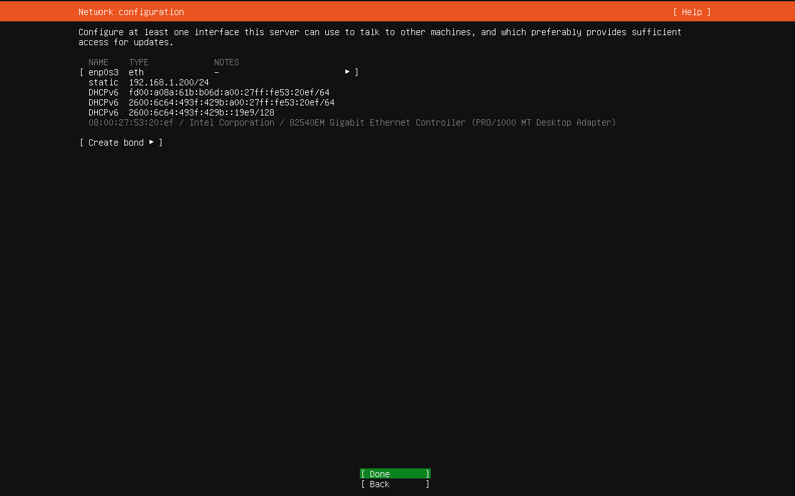 
3. Set up a host (A) record  on the AD DNS manager to point the hostname at the server's static IP, verified connection with nslookup
 
4. Verified communication between VMs via ping
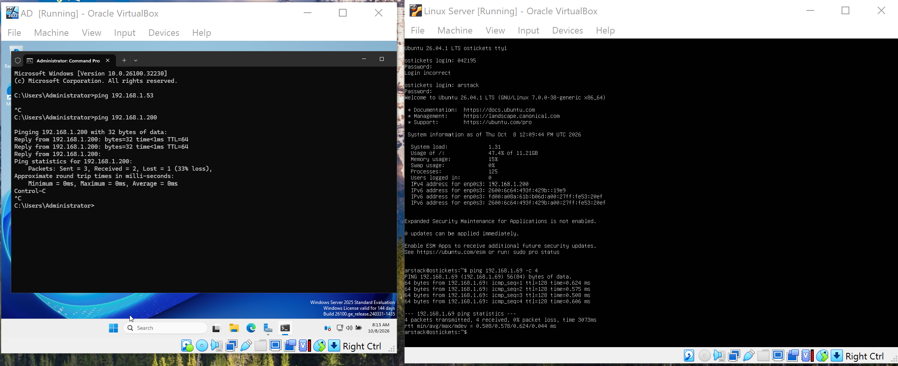
5. Configured Firewall settings on the Linux server to enable SSH and http to ensure the ticketing site is reachable.
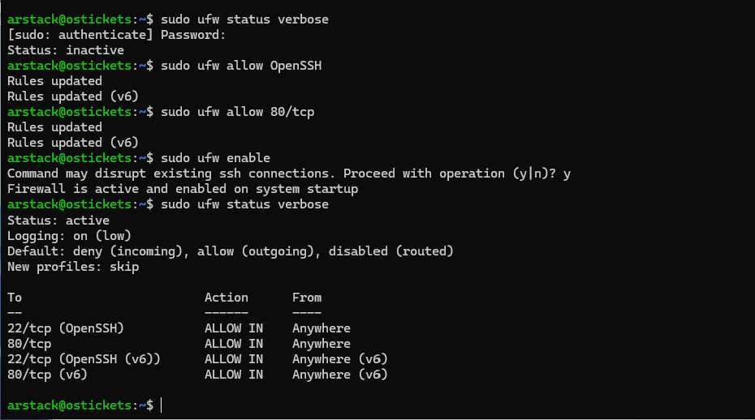 
6. Logged into the Linux Server from the Windows host via SSH. Downloaded the following packages to set up ticketing system: 
        - Apache - web server
        - MariaDB - database server
        - PHP - programming language for osTicket
        - libapache2-mod-php - module to connect Apache to PHP
        - php-mysql - driver to connect PHP to MariaDB

  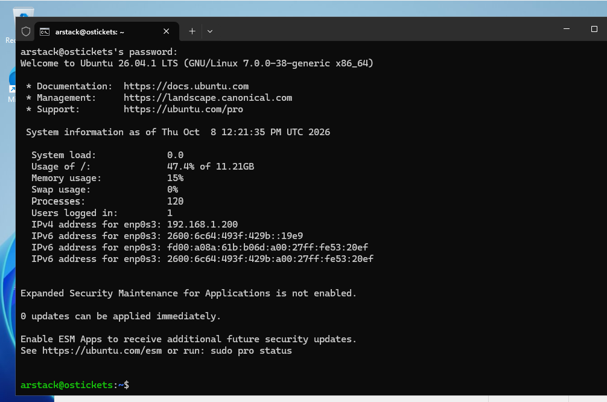
  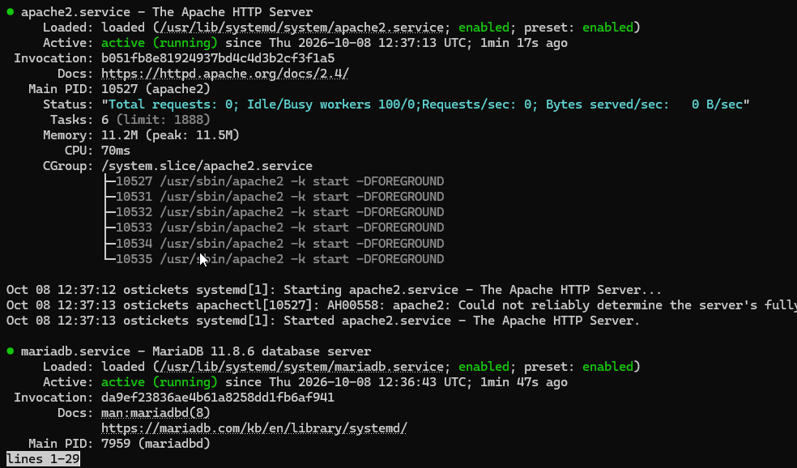

7. Ran the secure installer on MariaDB
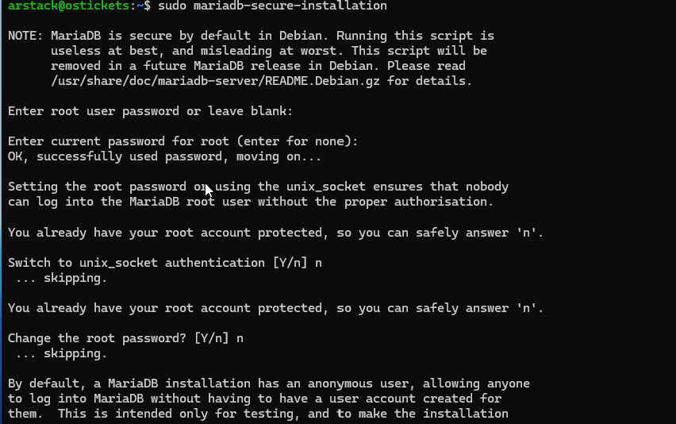 
8. Logged into MariaDB - created new 'osticket' database, and osticket_user (separate from root to enforce principle of least privilege.) 
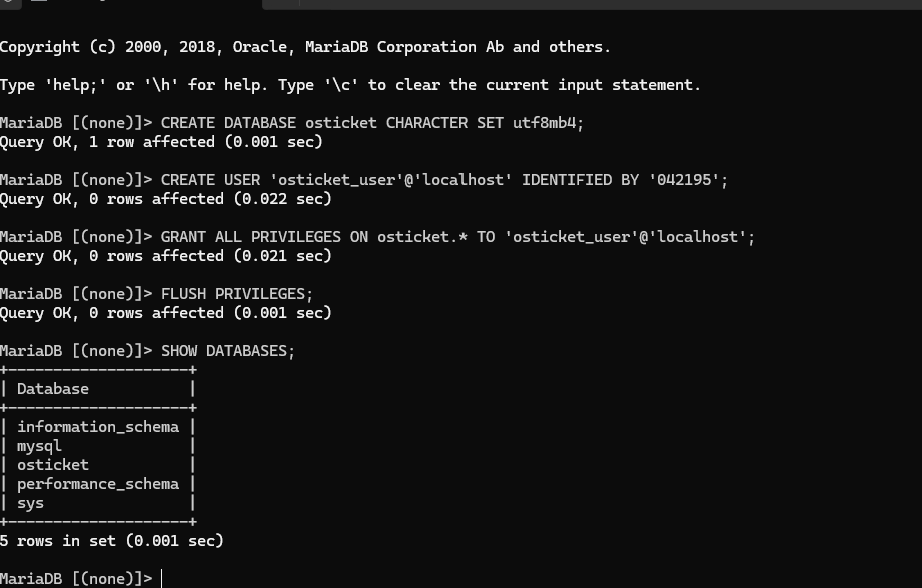 
9. After downloading osTicket with wget - I unzipped it and copied the application into Apache's web root (using sudo cp -R) in order to make it reachable via browser - then I gave Apache ownership of the entire folder using chown -R to allow the installer to write to the file.
10. Opened osTicket from the browser and ran the installer successfully 
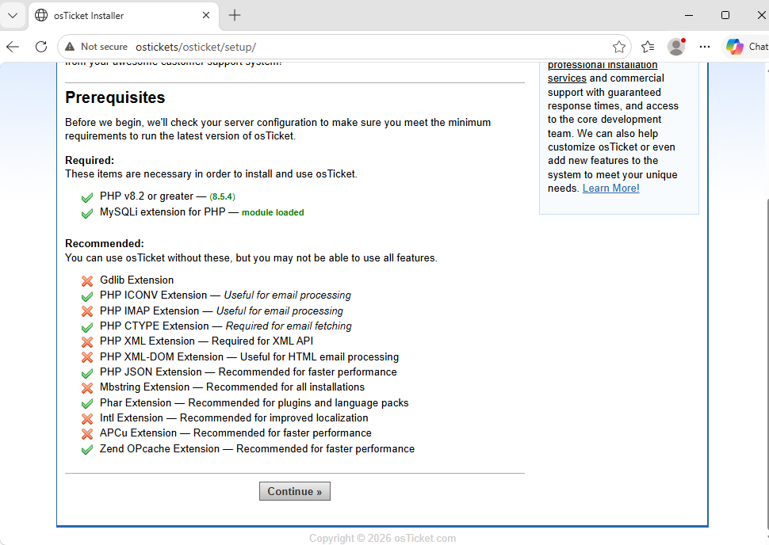
11. Took recommended security hardening steps from the post-install screen
            - Deleted the setup folder (using rm -r) to prevent the installer from running again with changed settings. 
            - Ran chmod 0444 to set the config file to read-only.    
    Before:
      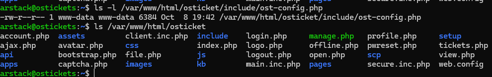
    After:
      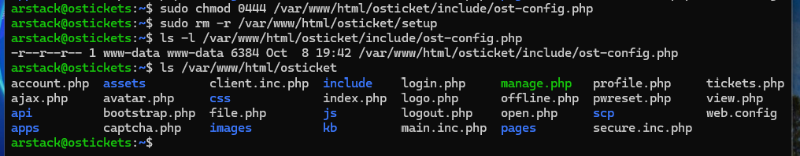

12. Logged into osTicket and created several fictional agents, with varying levels of privilege, as well as Help Topics for the drop-down list
13. Accessed the user-side of osTicket to verify additions to drop-down list were successful and submitted a ticket. 
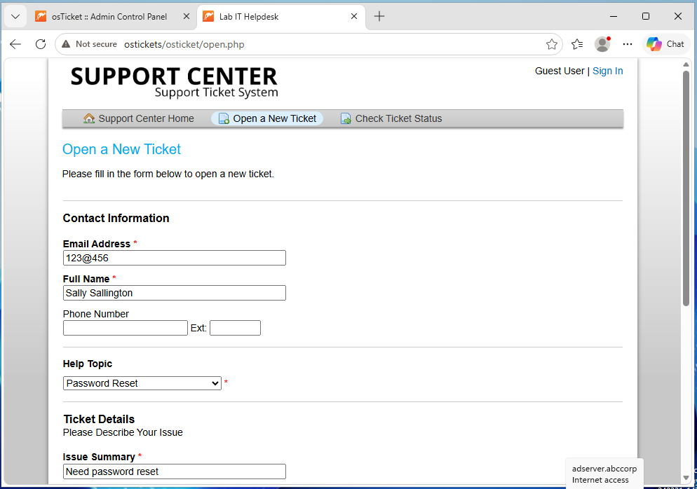
14. Switched back to admin window to ensure successful ticket submission. 
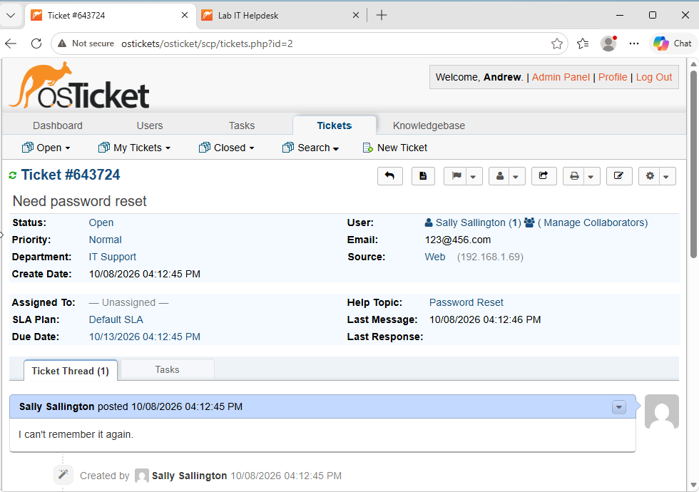
15. Logged in to third VM as a test user that is already set up within the domain - submitted a ticket requesting a password reset.
16. Received ticket on osTicket - reset the password in Active Directory with a forced change at next logon, confirmed the change prompt on the client, and closed the ticket.
IT Side:
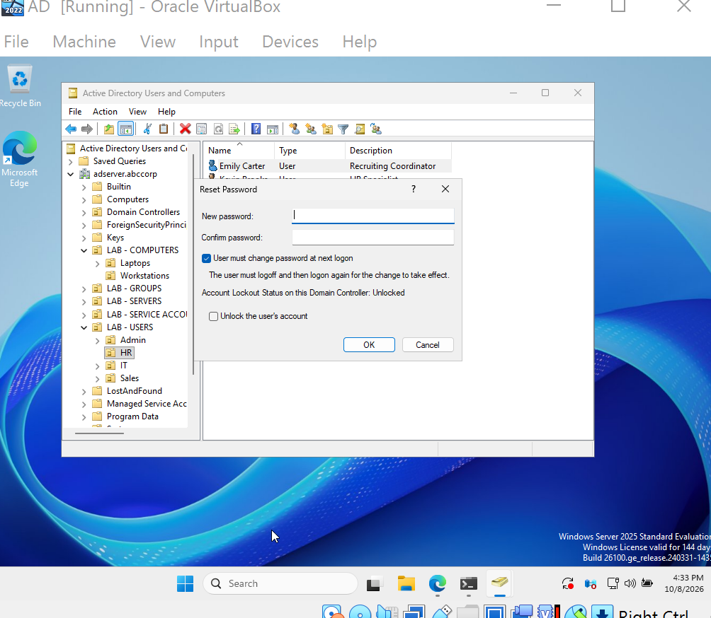
User Side:
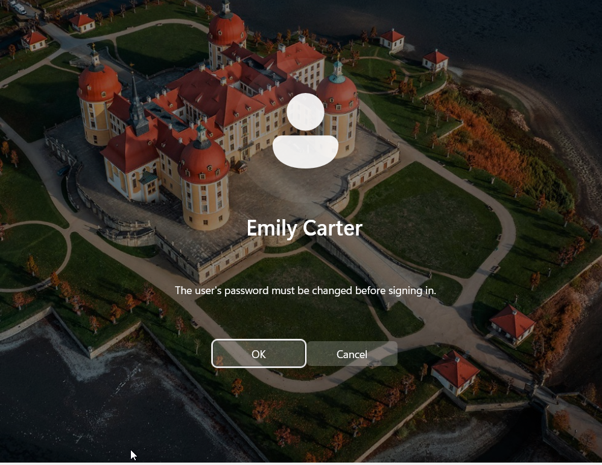

### Notes
 osTicket's current version documentation lists PHP 8.2-8.4 - I downloaded 8.5 and it ran without issue, save for one blank window that worked on page refresh.

### Troubleshooting 
1. Windows PC was unable to find the shared Samba folder from Linux PC | FIXED: There was a typo in the smb.conf file (a dash where an equals sign was needed)
2. SSH Login failed | FIXED: Incorrect syntax ssh username@logindestination 
3. osTicket will not download via CLI Error 404 then downloaded a .git instead of a .zip | FIXED: Found the correct .zip link from the assets list. 

### Result
My fictional company "abccorp" now has a working ticketing system accessible via browser. Domain machines can reach the ticketing portal by name, submit tickets from a browser, and I resolve them as an agent - including a password reset via Active Directory. 

### Next Steps 
1. Set up HTTPS
2. Set up a backup script
3. Automate onboarding with PowerShell

